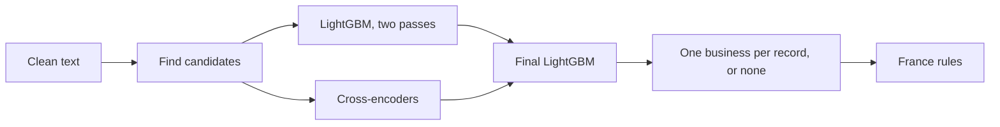

# BlurredVizion: Business Entity Resolution

This is my team's solution to the Amazon ML Challenge 2026, which ran from 25 to 27 September 2026. I built it with
my teammate Aniket Sahu, and our final public leaderboard score was 0.986971 (macro F0.5).

## The problem

There are business records from three sources, and they share no ids. Source 1 is a clean list of businesses in the
US, India and France (1.73M of them in the test set). Sources 2 and 3 have about 10M records that are noisy copies
of those businesses. The copies have typos, names in Indian scripts, legal forms swapped or dropped, names written as
initials or as a website, and addresses that are shortened or missing.

Some records are decoys: they look like a real business but match nothing. About a quarter of the training records
are decoys, and the test set has roughly twice as many per business. Most of them are a real business with the house
number pushed up by 1 to 60 and one part of the name changed.

France only shows up in the test set (15% of the businesses), so there are no labels for it at all.

The score is F0.5 per Source 1 business, averaged over all of them. Precision counts twice as much as recall, so a
wrong match hurts more than a missed one.

## Results

| | |
|---|---|
| Public leaderboard (macro F0.5) | 0.986971 |
| Validation, India/US (22,224 held-out businesses) | 0.9894 |
| True pairs found by blocking and embedding search (validation) | 98.48% |
| Candidate pairs on test | 63.2M |

Everything ran on my laptop (16 CPU threads, 13 GB RAM, a 6 GB GPU), with a few France and stage-2 runs on
Aniket's MacBook.

## How it works



The biggest decision was to work from the Source 2/3 side. Each of those records belongs to at most one business,
so for every record the question is just "which business, if any?" That turns a messy many-to-many problem into a
choice between about ten candidates, and it gets rid of most wrong merges early.

The steps:

1. Clean the text. Every script is converted to Latin letters with `anyascii`, street abbreviations are expanded,
   and legal words are stripped to get a "core" name.
2. Find candidates. Each record looks for businesses that share its rarest words. Sound keys help here, so
   `imdiyn emtrpraiss` still finds `indian enterprises`. On top of that, an embedding search, a dictionary for
   Indian-script names (learned from the training pairs) and a small initials/website matcher add the candidates
   that word blocking misses.
3. Score the pairs. A LightGBM model on about 40 name, address and number features does a first pass, and a second
   pass also looks at the other records competing for the same business. Separately, two multilingual-e5
   cross-encoders read both records together and score the pair.
4. Combine all the scores in a final LightGBM model. A record gets its best candidate only if that candidate scores
   at least 0.3 and is 0.5 ahead of the runner-up. Otherwise it stays unmatched.
5. Handle France on its own.

France was the hardest part. With no labels, models trained on India and the US happily matched French decoys. What
worked was training a France-only cross-encoder on pairs that simple rules could vouch for (same name and house
number, or same address and a similar name), plus pairs another model was almost certain about. A French match then
only survives if both the stage-2 model and this cross-encoder accept it. That one change moved the leaderboard from
0.978 to 0.982. The rest came from reading French records by hand and writing rules for how their decoys are made,
for example by swapping the organisation word (`lille amicale sarl` becomes `lille club sarl`).

Reading the errors was the most useful thing we did. That's how we found the house-number pattern, and that filler
words come from two separate lists. When "Services" or "Sri" is added at the same address, it's a true copy every
time. When "Holdings" or "Group" is added, it never is.

The details and the numbers for each step are in [docs/methodology.md](docs/methodology.md).

## Leaderboard progression

| Change | Public leaderboard |
|---|---|
| Better blocking, number fixes, partner features | 0.940 |
| Stronger LightGBM | 0.948 |
| Second LightGBM pass and cross-encoders | 0.963 |
| France decided by stage 2, French address words cleaned | 0.978 |
| French matches kept only if the France cross-encoder agrees | 0.982 |
| Initials and website-name matcher | 0.982661 |
| Remove French organisation-word swaps (`amicale` → `club`) | 0.985243 |
| Larger learned vocabulary, same-address recoveries | 0.986914 |
| Remove French matches with a raised house number and an added decoy word | 0.986971 |

## Running it

The challenge data isn't in this repo. Put the challenge kit at `student_resource/`, so the data ends up in
`student_resource/dataset/{train,test}/`. Then install:

```
uv venv --python 3.12 && source .venv/bin/activate
uv pip install -r requirements.txt
```

Every command, in order, is in [docs/reproduce.md](docs/reproduce.md). Intermediate files go to `work/` and the
submission files go to `output/`. A fresh run gets close to our submitted file but won't match it exactly, since
the models were trained once with random sampling.

## Repository layout

```
.
├── src/              # cleaning, blocking, LightGBM, cross-encoders, final model
│   └── tools/        # France models and rules, initials matcher, file assembly
├── docs/
│   ├── methodology.md   # how it works and what we measured
│   └── reproduce.md     # every command, in order
└── requirements.txt
```

The challenge data, our output files and the trained models aren't included. The data belongs to the organisers,
and the pipeline rebuilds everything else. We only used the provided data, with no external data, APIs or lookups.
The models are `intfloat/multilingual-e5-small` and `intfloat/multilingual-e5-base` (both MIT) and LightGBM.
